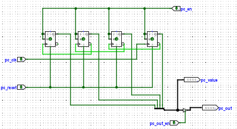
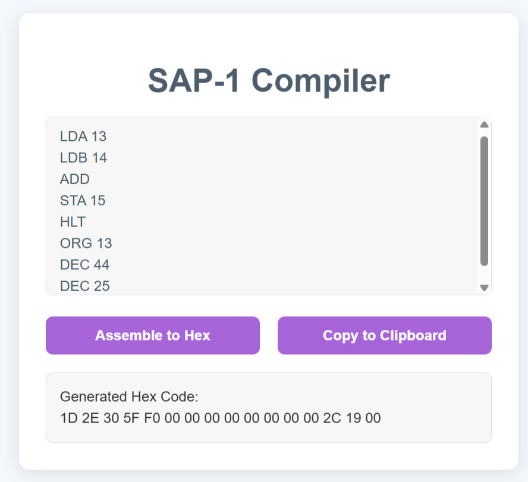
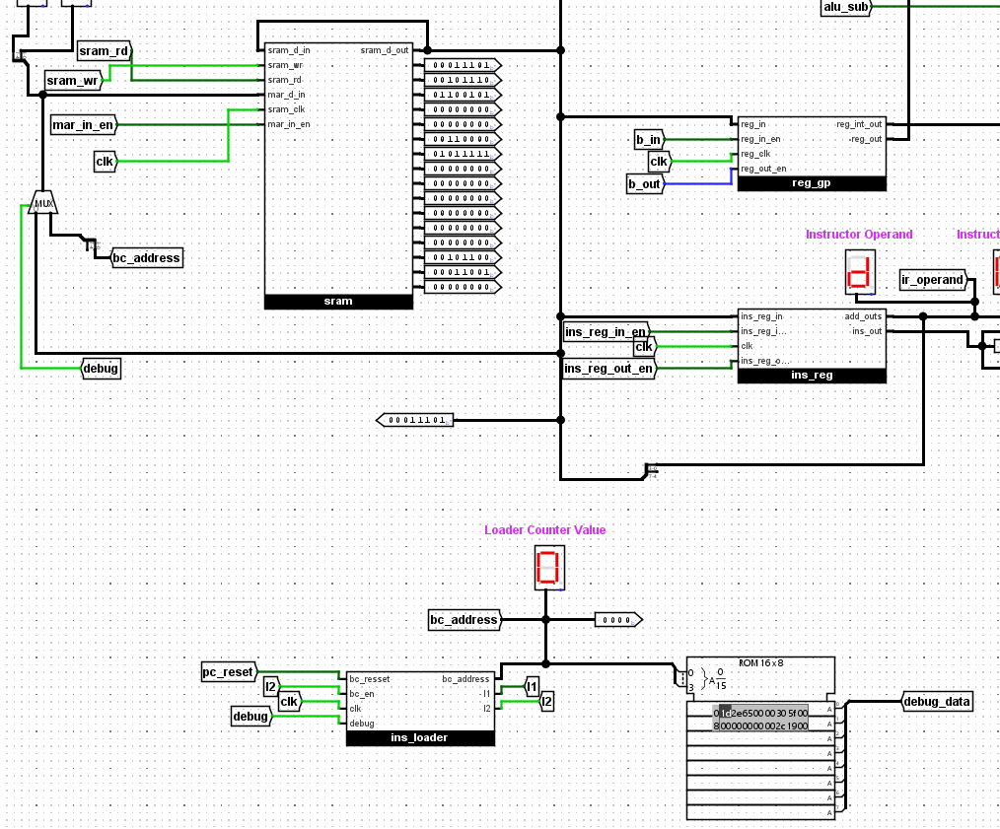
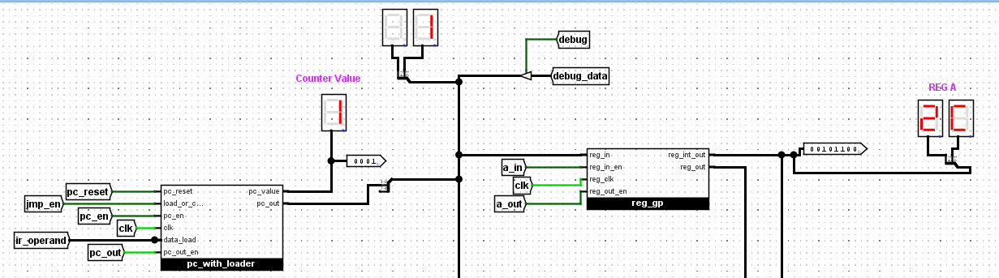
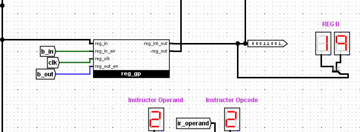
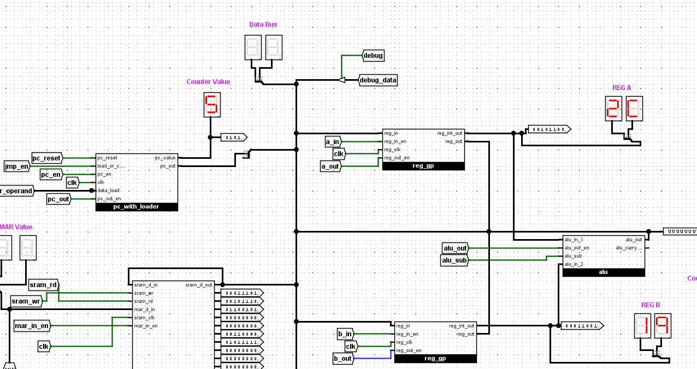
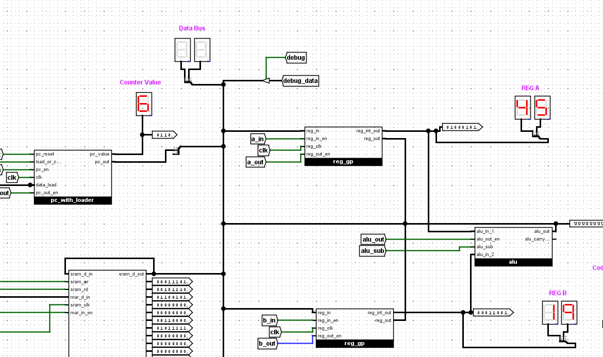
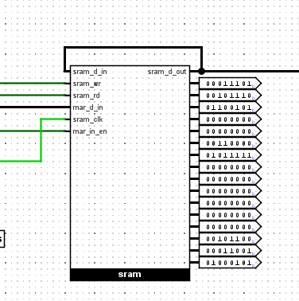

# SAP-1-Architecture-Logisim
## Table of Contents
Click on the Table of Contents below to directly go to the sections:

- [Project Overview](#project-overview)
- [Objectives](#objectives)
- [Key Features](#key-features)

- [Architecture and Functional Block Analysis](#architecture-and-functional-block-analysis)
  - [System Architecture Overview](#system-architecture-overview)
  - [Register Implementation (A, B)](#register-implementation-a-b)
  - [Program Counter (PC) Implementation](#program-counter-pc-implementation)
  - [Memory System and Address Register](#memory-system-and-address-register)
  - [Instruction Register and Opcode Decoder](#instruction-register-and-opcode-decoder)
  - [Arithmetic Logic Unit (ALU) Implementation](#arithmetic-logic-unit-alu-implementation)
  - [Boot/Loader Counter and Phase Generation](#bootloader-counter-and-phase-generation)

- [Control System Design](#control-system-design)
  - [Timing Control Generator](#timing-control-generator)
  - [Automatic Operation Control Logic](#automatic-operation-control-logic)
  - [Manual/Loader Operation Control](#manualloader-operation-control)

- [Instruction Set Architecture](#instruction-set-architecture)
  - [Instruction Encoding Scheme](#instruction-encoding-scheme)
  - [Assembler](#assembler)

- [Operation](#operation)
  - [Fetch–Decode–Execute Cycle](#fetchdecodeexecute-cycle)
  - [Running the CPU in Manual Mode](#running-the-cpu-in-manual-mode)
  - [Running the CPU in Automatic Mode (JMP + ADD Program)](#running-the-cpu-in-automatic-mode-jmp--add-program)

- [Future Improvement](#future-improvement)
- [Conclusion](#conclusion)

## Project Overview

This project implements an enhanced 8-bit **SAP-1** computer in **Logisim Evolution** with hardwired control and an extended instruction set (`LDA`, `LDB`, `ADD`, `SUB`, `STA`, `JMP`, `HLT`).  
It supports **Automatic Mode** (fetch-decode-execute cycle) and **Manual/Loader Mode** for program transfer.  
A **control sequencer** manages the bus and timing, while a web-based assembler converts assembly code into Logisim-compatible images.  
Test programs verified correct instruction execution and memory operations, making it a reliable framework for undergraduate learning in processor architecture.

## Objectives

- Develop an improved **SAP-1 (8-bit)** computer in **Logisim Evolution** for educational demonstration and system-level analysis.  
- Implement a classical **single-bus architecture** with 8-bit data path, 4-bit address space (16 bytes), and a **hardwired control sequencer** managing the fetch–decode–execute cycle.  
- Support **Automatic Mode** (six-stage ring counter T1–T6 with opcode decoder) and **Manual/Loader Mode** for safe program loading into RAM.  
- Design a datapath with **dual 8-bit registers** (accumulator and B register), a **ripple-carry ALU** (ADD/SUB), **4-bit program counter** with increment/load, **memory address register**, **16×8 SRAM**, and an instruction register (opcode + operand) while enforcing strict single-driver bus operation.

## Key Features

- Enhanced 8-bit **SAP-1** with a single-bus architecture (16-byte memory) and hardwired control.  
- Supports core instructions: `LDA`, `LDB`, `ADD`, `SUB`, `STA`, `JMP`, `HLT`.  
- Dual modes: **Automatic** (fetch-decode-execute) and **Manual/Loader** for safe program transfer.  
- Datapath: Accumulator & B registers, ripple-carry ALU, 4-bit PC, MAR, 16×8 SRAM, Instruction Register.  
- **Opcode decoder** and **control sequencer** manage timing and bus operation.  
- Lightweight web-based **assembler** converts assembly to Logisim HEX.  
- Step-by-step simulation ready with probes for registers, bus, ALU, and memory.  
- Easily **extensible** for new instructions or features.

## Architecture and Functional Block Analysis

### System Architecture Overview
The processor architecture uses a *unified single-bus design* with an *8-bit datapath* controlled by tri-state sources. Bus arbitration ensures that only *one driver* is active during each T-state, with possible drivers including pc_out, sram_rd, ins_reg_out_en, a_out, b_out, alu_out, and sh_out. Bus listener components such as mar_in_en, ins_reg_in_en, a_in, b_in, and sram_wr allow selective data capture when required.

|:--:|
| *Figure 1: Automatic mode operation of the control sequencer showing fetch–decode–execute sequencing.* | 

|:--:|
|*Figure 2: Manual/Loader mode operation of the control sequencer showing secure program loading with debug and handshake signals.*|  

### Register Implementation (A, B)

The *A and B registers* use reg_gp modules to store *8-bit data*. They have three interfaces:

1. *Input:* Connected to the system bus; controlled by a_in and b_in signals.  
2. *Output:* Drives the bus via tri-state logic using a_out and b_out.  
3. *Internal:* Provides direct access to the *ALU* through reg_int_out without using the bus.

|:--:|
|*Figure 3: A/B register subsystem with input, output, and internal interfaces.*|

### Program Counter (PC) Implementation

The *Program Counter (PC)* supports *dual modes* for sequential execution and program flow control:

- *Increment Mode:* At timing state T3, when pc_en = 1, the PC updates as PC ← PC + 1, enabling sequential instruction progression.  
- *Jump Mode:* During a JMP instruction at timing state T4, when jump_en = 1, the lower nibble of the Instruction Register (IR) is placed on the bus and loaded into the PC for direct program control transfer.  

*Bus Interface:* At timing state T1, when pc_out = 1, the current PC value is driven onto the system bus and loaded into the *Memory Address Register (MAR)* to start the instruction fetch cycle.
 

|:--:|
|*Figure 4: Program Counter showing *increment and jump modes.*|

|:--:|
|*Figure 5: Program Counter direct load and sequential functionality.*|

### Memory System and Address Register

The memory subsystem includes a *4-bit Memory Address Register (MAR)* which captures addresses from the system bus under the control of mar_in_en.

- *Instruction Fetching:* During the T1 phase, pc_out and mar_in_en load the Program Counter value into the MAR for instruction fetch.  
- *Operand Addressing:* During T4 of LDA, LDB, STA, or JMP instructions, ins_reg_out_en together with mar_in_en transfers the operand address (IR[3:0]) into the MAR.

The *SRAM* operates in two modes:  
- *Read Mode:* When sram_rd = 1, the value at RAM[MAR] is placed on the bus during T2 (instruction fetch) and T5 (LDA/LDB).  
- *Write Mode:* When sram_wr = 1, the data on the bus is written into RAM[MAR] during T5 of the STA instruction.

|:--:|
|*Figure 6: Register-based memory element showing data_in, wr_en, rd_en, clock, and chip select (cs) signals. Output to the bus is via data_out.*|

|:--:|
|*Figure 7: Memory subsystem showing MAR operation and SRAM read/write timing.*|

### Instruction Register and Opcode Decoder

The *Instruction Register (IR)* has a dual role for *instruction storage* and *operand handling*:

1. *Instruction Loading:* During T2, signals sram_rd = 1 and ins_reg_in_en = 1 transfer IR ← M[MAR], capturing the instruction from memory.  
2. *Opcode Handling:* The upper nibble IR[7:4] goes to the *opcode decoder* (ins_tab), generating one-hot control signals for the decoded instruction.  
3. *Operand Handling:* The lower nibble IR[3:0] can be placed onto the system bus when ins_reg_out_en = 1 (typically during T4) to provide operand addresses or target values for memory and jump instructions.

The *opcode decoder (ins_tab)* implements a *4-to-16 decoding scheme*, producing one-hot signals such as insLDA, insLDB, insADD, insSUB, insSTA, insJMP, insHLT, with unused outputs reserved for future instructions.

|:--:|
|*Figure 8: Architecture of the Instruction Register and opcode decoder, showing instruction loading, opcode routing, and operand forwarding.*|

### Arithmetic Logic Unit (ALU) Implementation

The *ALU subsystem* performs *8-bit arithmetic* with the following features:

- *Input Sources:* Operands come directly from A.reg_int_out and B.reg_int_out, bypassing the bus.  
- *Operation Control:* alu_sub = 1 selects subtraction (A − B); otherwise, addition (A + B) is performed.  
- *Execution Protocol:* During T4, with a_out = 1, b_out = 1, alu_out = 1, and a_in = 1, the ALU executes A ← A ± B in one step.  
- *Architectural Design:* Ripple-carry adder with mode control; simple hardware with linear carry propagation delay.  
- *Bus Interface:* ALU output drives the system bus only when alu_out = 1 via tri-state logic.

|:--:|
|*Figure 9: ALU implementation with ripple-carry architecture and tri-state bus interface.*|

### Boot/Loader Counter and Phase Generation

The *boot/loader subsystem (ins_loader)* securely transfers program data from ROM to RAM in *Manual/Loader mode*:

1. *Functional Role:* Loads programs from ROM to RAM when debug = 1, disabling normal fetch-execute logic.  
2. *Input Interface:* Accepts clk, bc_reset (counter reset), bc_en (count enable), and debug for mode selection.  
3. *Address Sequencing:* Uses a 4-bit CTR4 counter for upward counting, producing addresses bc_address[3:0] for systematic RAM writes.  
4. *Phase Control:* Generates two non-overlapping clock phases (Φ and ¬Φ) via a D flip-flop with feedback inversion to synchronize data transfer and prevent contention.

|:--:|
|*Figure 10: Boot/loader subsystem with sequential address generation and dual-phase clocking.*|

## Control System Design

The control unit translates instructions into precisely timed control pulses to:  
1. Ensure exclusive bus driver activation.  
2. Enable appropriate latch operations during each T-state.  

Key components include:  
- **Ring Counter (RC)**: Generates timing states T1–T6.  
- **Opcode Decoder**: Produces activation lines for instruction-specific micro-operations.  
- **Mode Control Inputs**: `debug` (manual/loader selection), `i1/i2` (loader handshake), defining CPU mode (`~debug` with loader masking via `~i2`).  

The control sequencer operates in two paradigms:  
- **Automatic Execution Mode**: Optimized for fetch–decode–execute cycles.  
- **Manual/Loader Mode**: Optimized for safe program loading and debugging.  

Both modes maintain strict signal integrity and timing synchronization.

|:--:|
| *Figure 11: SAP-1 for Manual mode* |

The Manual Mode control sequencer provides a simplified execution pathway, supporting only the `ADD` instruction.  
This minimal configuration is intended for **step-wise verification** and **manual debugging** of instruction flow, allowing clear observation of **bus activity** and **control signal sequencing** during arithmetic operations.

|:--:|
| *Figure 12: SAP-1 for Automatic mode* |

The Automatic Mode control sequencer manages the full **fetch–decode–execute cycle** and supports `ADD`, `SUB`, and `JMP` instructions.  
Instruction execution is orchestrated by combining **ring counter timing states** with **opcode decoding logic**, producing deterministic micro-operation sequences.  
This implementation ensures **efficient bus utilization** and **precise timing coordination** across all program phases.

## Timing Control Generator

The timing subsystem uses a **ring counter** generating six phases (T1–T6) to orchestrate the **fetch–decode–execute cycle**, ensuring deterministic micro-operation sequencing and synchronization across datapath components.

### Universal Fetch Sequence
For every instruction:  
- **T1**: Program Counter (PC) output enabled and captured by Memory Address Register (MAR ← PC).  
- **T2**: Memory read initiated (`sram rd`) and Instruction Register loaded (IR ← M[MAR]).  
- **T3**: Program Counter incremented (PC ← PC + 1).  

|:--:|
| *Figure 13: Six phase ring counter* |

### Representative Execute Sequences
- **LDA addr**:  
  - T4: Operand address (IR[3:0]) placed on bus and loaded into MAR.  
  - T5: Memory value read and latched into A register (A ← M[MAR]).  
- **ADD**:  
  - T4: A and B register outputs drive ALU; result fed back to A (alu_sub = 0).  
- **SUB**:  
  - T4: Similar to ADD but with subtraction enabled (alu_sub = 1, A ← A – B).  
- **JMP addr**:  
  - T4: Operand placed on bus and loaded into Program Counter (PC ← IR[3:0]).

## Automatic Operation Control Logic

The automatic operation control logic defines core minterms using:  

- **C = CPU ~debug**  
- **L = ~i2 (loader idle)**  

These signals coordinate the fetch–decode–execute cycle, ensuring precise timing and correct activation of micro-operations during automatic instruction execution.

|:--:|
| *Figure 14: Automatic mode control sequencer demonstrating full instruction set.* |

**Table 1: Fetch Control Equations**

| Signal          | Equation                                                       |
|-----------------|----------------------------------------------------------------|
| pc_out          | T1 & C                                                         |
| mar_in_en       | (T1 & C) \| (T4 & C & (insLDA \| insLDB \| insSTA \| insJMP))  |
| sram_rd         | (T2 & C) \| (T5 & C & (insLDA \| insLDB))                      |
| ins_reg_in_en   | T2 & C                                                         |
| pc_en           | T3 & C                                                         |

**Table 2: ALU and Register Control Equations**

| Signal  | Equation                                              |
|---------|------------------------------------------------------|
| alu_out | T4 & C & (insADD \| insSUB)                          |
| alu_sub | T4 & C & insSUB                                      |
| a_in    | (T5 & C & insLDA) \| (T4 & C & (insADD \| insSUB))   |
| b_in    | T5 & C & insLDB                                      |
| a_out   | (T4 & C & (insADD \| insSUB)) \| (T5 & C & insSTA)   |
| b_out   | T4 & C & (insADD \| insSUB)                          |

## Manual/Loader Operation Control

In Manual/Loader mode, the control logic uses `debug = 1` to **mask normal CPU fetch–decode–execute operations**, suspending standard execution for safe program loading.  

Program transfer follows a **handshake protocol**:  
- `i1` enables address placement into the Memory Address Register (MAR).  
- `i2` activates write operations into SRAM.  

This stepwise handshake ensures **safe memory loading** without bus contention, while debug masking prevents interference from normal CPU execution.

|:--:|
| *Figure 15: Architecture of the Manual/Loader control system.* |

## Instruction Set Architecture

### Instruction Encoding Scheme
The instruction encoding system utilizes **upper nibble = IR[7:4]** for opcode specification and **lower nibble** for 4-bit operand/address when required.

---

#### Table 1: Instruction Set & Program

| Address   | Instruction | Hex | Mnemonic & Explanation        |
|-----------|-------------|-----|--------------------------------|
| 00000000  | 00011101    | 1D  | LDA 13 (Load A from M[13])     |
| 00000001  | 00101110    | 2E  | LDB 14 (Load B from M[14])     |
| 00000010  | 01100101    | 65  | JMP 5 (PC ← 5)                 |
| 00000011  | 00110000    | 30  | ADD (A ← A + B)                |
| 00000100  | 01011111    | 5F  | STA 15 (M[15] ← A)             |
| 00000101  | 11110000    | F0  | HLT (Stop execution)           |

---

#### Table 2: Data Values in RAM

| Address (Binary) | Data (Binary) | Decimal | Hex |
|------------------|---------------|---------|-----|
| 0000101          | 00101100      | 44      | 2C  |
| 0000110          | 00011001      | 25      | 19  |
### Assembler

The assembler translates **SAP-1 assembly language programs** into **machine code (hexadecimal)** suitable for execution in Logisim.  
It supports instructions such as **LDA, LDB, ADD, SUB, STA, JMP, and HLT**, along with directives like **ORG** and **DEC**.  
The tool automatically generates **Logisim-compatible v2.0 raw hex output**, avoiding manual conversion errors.  

This enables efficient program development, testing, and debugging of the SAP-1 system.

---

#### 🔗 [Open the SAP-1 Assembler Tool](https://htmlpreview.github.io/?https://github.com/srananna/SAP1_Architecture_in_Logisim/blob/main/SAP_ASSEMBLER_2008044.html)

---

#### SAP-1 Assembler Interface

*Figure 16: Web-based SAP-1 assembler interface converting assembly instructions into Logisim-compatible hexadecimal code.*

---

#### Table 3: Examples of Assembly Programs and Corresponding Hex Codes

| Example         | Assembly Code                                                                                       | Hex Code                                      |
|-----------------|----------------------------------------------------------------------------------------------------|-----------------------------------------------|
| **ADD Program** | LDA 13, LDB 14, ADD, STA 15, HLT   (ORG 13, DEC 44, ORG 14, DEC 25)                              | 1D 2E 30 5F F0 00 00 00 00 00 00 2C 19 00 00  |
| **JMP + ADD Program** | LDA 13, LDB 14, JMP 5, ADD, STA 15, HLT   (ORG 13, DEC 44, ORG 14, DEC 25)                 | 1D 2E 65 30 5F F0 00 00 00 00 00 00 2C 19 00  |

---
## Operation

The CPU functions through a repetitive sequence of operations controlled by the system clock, commonly known as the **fetch–decode–execute** cycle.  
This process can be divided into three main stages:

---

### Fetch–Decode–Execute Cycle

**Fetch**
- **T1**: The Program Counter (PC) outputs the current instruction address onto the bus, which is then stored in the Memory Address Register (MAR).  
- **T2**: The memory unit provides the instruction stored at the MAR address onto the data bus, and the Instruction Register (IR) captures this instruction.  
- **T3**: The PC is incremented so it is ready to point to the next instruction in sequence.  

**Decode**  
- The opcode portion of the IR is forwarded to the instruction decoder, which activates the appropriate control line (e.g., LDA, ADD).  
- This decoded output, combined with the active timing state (T-state), defines the exact set of control signals required for execution.  

**Execute**  
- The control unit asserts the relevant signals to carry out the micro-operations of the decoded instruction.  
- The number of clock states required depends on the instruction type.  
  - Example: LDA typically requires two states, ADD takes two, while HLT completes in a single state.  
- This cycle continues automatically, instruction by instruction, until a HLT command is reached, at which point the CPU halts and the state counter is stopped.  

---

### Running the CPU in Manual Mode

To run the SAP-1 CPU in **Manual/Loader mode**, the following steps are followed:

**Initial Setup**
- Turn the debug pin OFF (LOW) to enable automated control.  
- Pulse the pc_reset pin once to reset the Program Counter (PC) to 0000.  
- Ensure the main clock (clk1) is OFF.  
- Set the en_run pin to HIGH to enable execution.  
- Configure the RAM (Debug Mode):  
  - Turn ON the debug pin (HIGH). This enables manual RAM programming.  

**For each instruction/data**
- Set address: Use debug_data to define the 8-bit memory address.  
- Load address into MAR: Pulse `mar_in_en_manual`.  
- Set instruction/data: Use debug_data to provide the 8-bit value.  
- Write to RAM: Pulse `ram_wr_manual`.  

**After loading instructions/data**
- Turn OFF the debug pin (LOW).  
- Pulse pc_reset to reset PC to 0000 for program execution.  

**Run the Program**
- **Manual stepping**: Press the clk button repeatedly to step through the Fetch–Decode–Execute cycle, observing PC, MAR, IR, A/B registers, and RAM.  
- **Continuous run**: Enable the continuous clock source for automated execution.  

**Observe HLT**
- When the HLT instruction is reached, the CPU halts, stopping the clock or state counter.  

**Verify Results**
- Check RAM address 00001111 (decimal 15).  
- The expected content is `01000101 (decimal 69)`, obtained from adding decimal 44 and decimal 25.  

---

### SAP-1 CPU Circuit Implementation

*Figure 17: SAP-1 CPU circuit implementation in Logisim Evolution, highlighting debug signals, control pins, and RAM verification for program execution.*
### Running the CPU in Automatic Mode (JMP + ADD Program)

To execute the CPU in automatic mode using the program with JMP and ADD instructions, follow the procedure below:

---

#### 1. Initial Setup
- Ensure the debug pin is set to LOW.  
- Ensure the main clock (clk1) is OFF.  
- Pulse the pc_reset pin once to reset the Program Counter to 0000.  
#### 2. Program the ROM
- Open the ROM component in Logisim Evolution.  
- Right-click on it and select **Edit Contents...**  
- A memory editor window will appear.  
- Enter the following hex code sequence into the ROM memory cells starting from address 0000:
- 1D 2E 65 00 30 5F F0 00 00 00 00 00 2C 19 00 00
#### 3. Load Program to RAM (Bootloader Mode)
- Set the debug pin to HIGH. The **Code Loading Mode LED** will turn ON.  
- With each clk pulse, the CPU will copy the program from ROM into RAM.  
  (Two clock pulses are required per instruction/data value.)  
- Allow the CPU to complete writing all instructions and data into RAM.  
- Observe MAR and Data Bus activity on the 7-segment displays during this phase.  

---

#### 4. Stop the Bootloader
- Set the debug pin back to LOW.  
- Pulse the main clk once to ensure the bootloader process safely stops.  

---

#### 5. Run the Program
- Pulse **pc_reset** again to reset the Program Counter to 0000.  
- Provide clock pulses (manual clicking or continuous clock) to let the CPU execute.  
- Observe PC, MAR, IR, Register A, and Register B values in the 7-segment displays through the Fetch–Decode–Execute cycle.  

---

#### 6. Execution Sequence
- Fetch LDA(13): load value at address 13 into Register A.  
- Fetch LDB(14): load value at address 14 into Register B.  
- Execute JMP 5: program counter jumps to address 5.  
- At address 5, execute ADD (Register A + Register B).  
- Execute STA(15): store the result into address 15.  
- Execute HLT, stopping the CPU.  

---

#### 7. Verify Result
- After execution, check RAM address **1111 (decimal 15)**.  
- Expected result: Register A and RAM[15] contain the sum of DEC 44 (0x2C) and DEC 25 (0x19), i.e., **0x45 (69 decimal)**.  

---

### SAP-1 CPU Execution (Automatic Mode)

#### After loading all instructions and data values into RAM

*Figure 18: After loading all instruction and data values into RAM memory.*

#### After executing LDA 13

*Figure 19: Value 44 is loaded from memory address 13 into Register A.*

#### After executing LDB 14

*Figure 20: Value 25 is loaded from memory address 14 into Register B.*

#### After executing JMP 5

*Figure 21: Program Counter updated to address 5, redirecting execution flow.*

#### After executing ADD

*Figure 22: Contents of Register A and Register B are added, and the result (69) is stored back into Register A.*

#### After executing STA 15

*Figure 23: The result from Register A (69) is written into memory address 15.*

## Future Improvement

Potential directions for extending the current SAP-1 implementation include:  

- **Status Flags**: Introduce Zero (Z) and Carry (C) flags to support conditional branch instructions (e.g., `JZ`, `JC`) for advanced control flow.  
- **Enhanced Memory & Instructions**: Support multi-byte memory addressing, immediate data loading, and richer instruction formats.  
- **Microcoded Control Unit**: Enable systematic ISA expansion for new operations like shift and rotate instructions.  
- **Expanded Assembler**: Develop an assembler with symbolic labels, expressions, and enhanced directive support to improve programmability, usability, and instructional validation.

## Conclusion

The enhanced SAP-1 successfully bridges classical processor design with modern simulation-based education.  
With dual operational modes, expanded instruction support, and a structured control sequencer, the system demonstrates technical correctness and pedagogical clarity.  
Validation through test programs confirmed proper execution, control logic, and timing coordination.  
This project provides a practical, extensible platform for undergraduate learning in computer architecture and lays the foundation for future enhancements in processor design and research.
